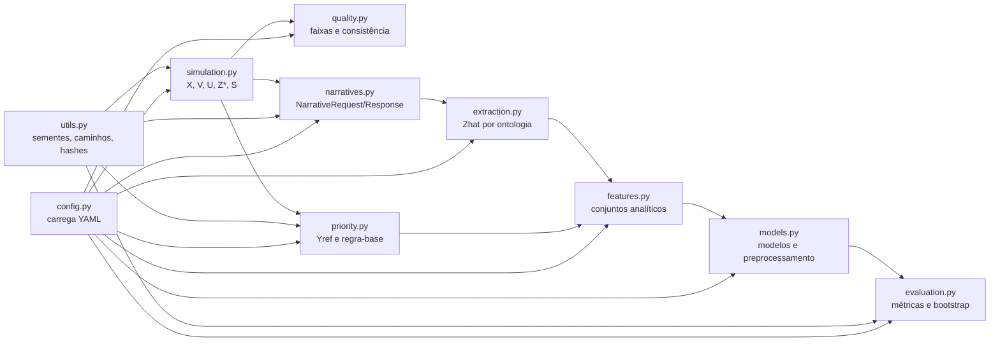

# C4 — Diagrama de componentes



## Interfaces críticas

### Geração narrativa

`narratives.py` recebe `NarrativeRequest` e produz `NarrativeResponse`. Nenhuma outra etapa deve depender de API ou fornecedor específico.

### Prioridade

`priority.py` produz `Yref` com base em `X`, `S` e `Z*`. Ele não deve acessar narrativa ou `Zhat` para construir a referência.

### Extração

`extraction.py` produz `Zhat` apenas a partir de texto. A comparação com `Z*` ocorre na validação, não durante a extração.

### Modelagem

`features.py` remove `u_latent_audit_only` e cria três conjuntos. `models.py` realiza pré-processamento dentro dos folds, e `evaluation.py` produz métricas a partir de predições.

## Regra de dependência

Dependências devem fluir da configuração e dos módulos de geração para artefatos, e não no sentido contrário. Em particular:

```text
Yref não → gerador de narrativa
U não → classificadores
Z* não substitui Zhat no conjunto operacional
```
