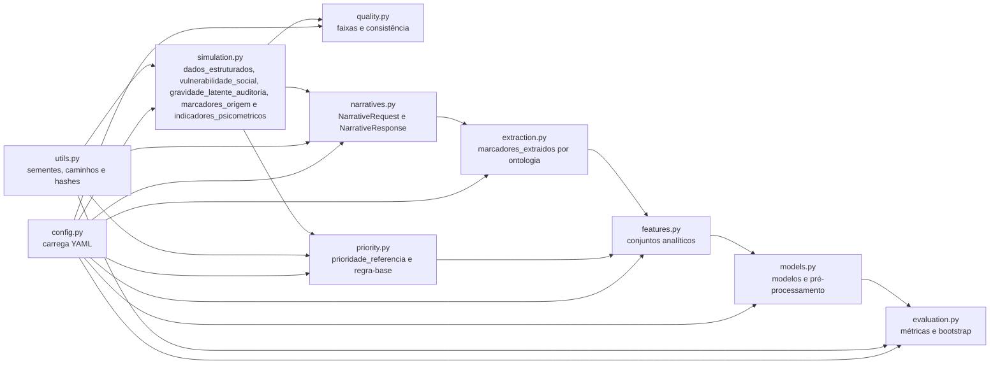

# C4 — Diagrama de componentes



## Interfaces críticas

### Geração narrativa

`narratives.py` recebe `NarrativeRequest` e produz `NarrativeResponse`. Nenhuma outra etapa deve depender de API ou fornecedor específico. O projeto inclui `TemplateNarrativeGenerator` e o adaptador opcional `GeminiNarrativeGenerator`.

### Prioridade

`priority.py` produz `prioridade_referencia` com base em `dados_estruturados`, `indicadores_psicometricos` e `marcadores_origem`. Ele não deve acessar `narrativa_clinica` ou `marcadores_extraidos` para construir a referência.

### Extração

`extraction.py` produz `marcadores_extraidos` apenas a partir de `narrativa_clinica`. A comparação com `marcadores_origem` ocorre na validação, não durante a extração.

### Modelagem

`features.py` remove `gravidade_latente_auditoria` e cria três conjuntos. `models.py` realiza pré-processamento dentro dos folds, e `evaluation.py` produz métricas a partir de previsões.

## Regra de dependência

Dependências devem fluir da configuração e dos módulos de geração para artefatos, e não no sentido contrário. Em particular:

```text
prioridade_referencia não entra no gerador de narrativa
gravidade_latente_auditoria não entra nos classificadores
marcadores_origem não substitui marcadores_extraidos no conjunto operacional
```
