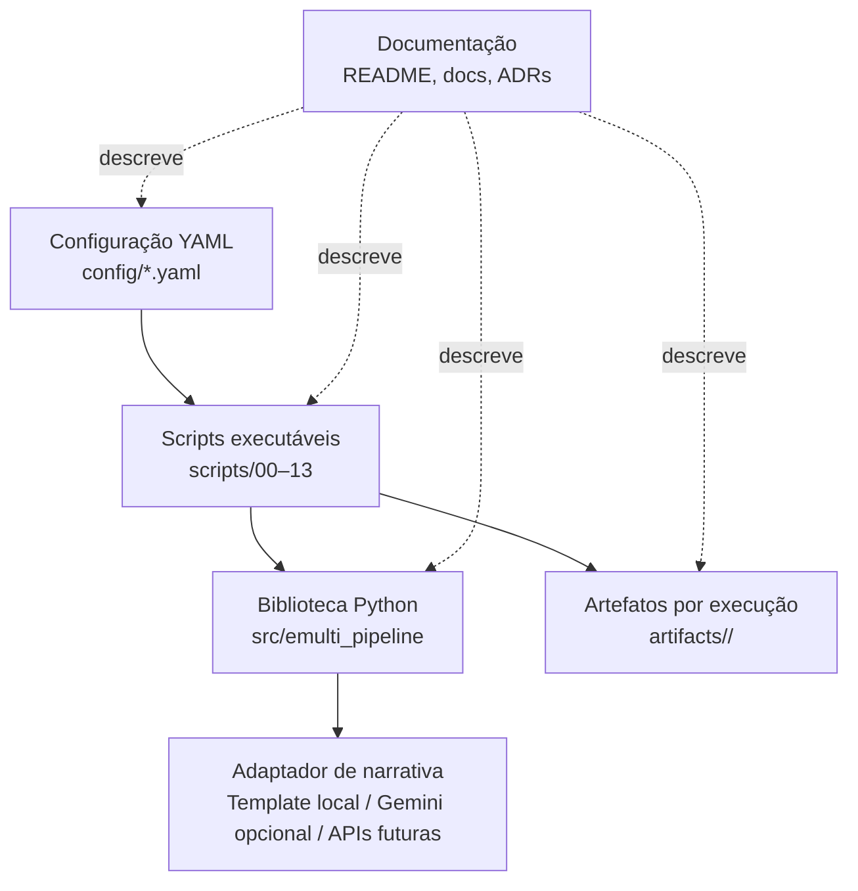

# C4 — Diagrama de contêineres

Neste repositório, “contêiner” é usado no sentido de grandes unidades executáveis e de armazenamento. Não implica necessariamente uso de Docker.

## Responsabilidades

| Unidade | Responsabilidade |
|---|---|
| `config/` | declarar hipóteses e parâmetros |
| `scripts/` | executar etapas e preservar a ordem metodológica |
| `src/emulti_pipeline/` | manter lógica reutilizável e contratos |
| `artifacts/` | armazenar saídas intermediárias e finais |
| `docs/` | registrar uso, arquitetura, contratos e decisões |
| adaptador de narrativa | converter `NarrativeRequest` em `NarrativeResponse` sem acessar `prioridade_referencia`; `template` local ou `gemini` opcional |
