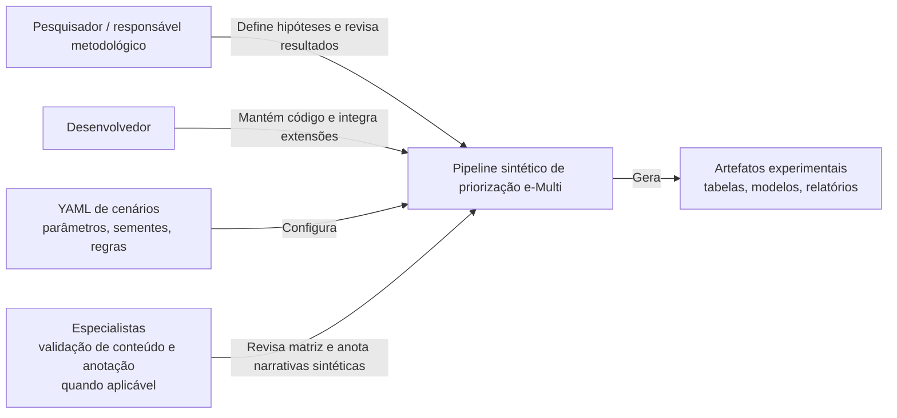

# C4 — Diagrama de contexto

## Limites

O diagrama não inclui sistemas de prontuário, pacientes, bases clínicas ou integração assistencial. Esses elementos estão fora do escopo da prova de conceito atual.

## Usuários principais

| Ator | Necessidade |
|---|---|
| Pesquisador | executar cenários e interpretar resultados sintéticos |
| Desenvolvedor | manter módulos, scripts, contratos e documentação |
| Especialista | validar conteúdo da matriz ou anotar textos sintéticos, quando a etapa for formalizada |
