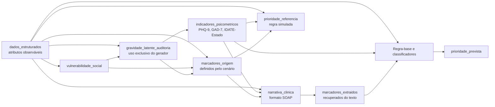

# Metodologia e fluxo de dados

## Fluxo lógico

## Ordem das etapas

1. `01_generate_profiles.py` gera `dados_estruturados`, `vulnerabilidade_social`, `gravidade_latente_auditoria` e `marcadores_origem`.
2. `02_simulate_psychometrics.py` produz itens e totais de `indicadores_psicometricos` a partir de sinais latentes e atributos.
3. `03_quality_control_base.py` valida faixas, somas, consistência e propriedades descritivas.
4. `04_generate_narratives.py` gera `narrativa_clinica` a partir de `dados_estruturados`, `indicadores_psicometricos` e `marcadores_origem`.
5. `05_assign_reference_priority.py` gera `prioridade_referencia` por uma matriz de regras simuladas.
6. `06_extract_markers.py` transforma `narrativa_clinica` em `marcadores_extraidos`.
7. As etapas seguintes validam a extração, formam conjuntos, treinam modelos, avaliam robustez e geram relatório.

A ordem entre a etapa textual e a prioridade é intencional: ela impede que `prioridade_referencia` seja fornecida ao gerador de texto ou se torne uma pista lexical acidental.

## Três conjuntos analíticos

| Nome do arquivo | Conteúdo | Papel analítico |
|---|---|---|
| `01_estruturados_escores.csv` | `dados_estruturados + indicadores_psicometricos` | Cenário mínimo com informação estruturada e psicométrica |
| `02_limite_superior_marcadores_origem.csv` | `dados_estruturados + indicadores_psicometricos + marcadores_origem` | Limite superior: assume acesso direto aos marcadores definidos pelo cenário |
| `03_operacional_marcadores_extraidos.csv` | `dados_estruturados + indicadores_psicometricos + marcadores_extraidos` | Cenário operacional: usa informação recuperada da narrativa |

A diferença entre os conjuntos de limite superior e operacional estima a perda atribuível à extração de informações a partir de texto.

## Prioridade de referência

`prioridade_referencia` é uma variável ordinal com quatro categorias: `baixa`, `moderada`, `alta` e `urgente`. A classe urgente é uma categoria de segurança simulada, não uma posição comum em fila.

A regra atual combina:

- regras determinísticas para situações urgentes;
- evidências de alta e moderada prioridade baseadas em escores, vulnerabilidade, funcionamento e marcadores;
- ruído pré-especificado apenas entre classes não urgentes.

Consulte [Matriz de prioridade](../reference/matriz-de-prioridade.md) para detalhes e limitações.

## Avaliação

A modelagem usa uma regra-base e modelos treináveis. A avaliação inclui validação cruzada aninhada no conjunto de desenvolvimento e conjunto final de teste isolado. As métricas incluem F1 macro, métricas por classe, AUPRC para alta e urgente, AUC-ROC multiclasse, kappa ponderado, erro ordinal, calibração e intervalos por bootstrap.

## Rastreabilidade

Cada execução tem um `run_id`. O pipeline cria diretórios ordenados por etapa em `artifacts/<run_id>/`, grava manifests e preserva sementes, parâmetros, hashes e metadados de geração.

Consulte [Nomenclatura do pipeline](../reference/nomenclatura.md), [Contratos de dados](../reference/contratos-de-dados.md) e [Artefatos](../reference/artefatos.md).
